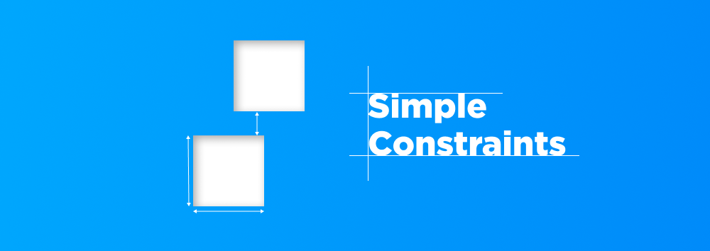

<p align="center">
    
</p>

# SimpleConstraints

SimpleConstraints is a Swift library designed to simplify the process of creating and managing constraints in UIKit. It provides a set of utilities that make it easier to align and position UI elements in your iOS applications.

## Features

- Easy to use API for creating and managing constraints.
- Support for safe area constraints.
- Convenience methods for common layout tasks.
- Each function sets all needed constraints to display an object (including adding the subview and setting `translatesAutoresizingMaskIntoConstraints` to `false`)

### Preview

Let's add an image to a view using the regular UIKit constraints with the following attributes:
- Said image shall be pinned to the top using `safeAreaLayoutGuide`.
- The right and left anchor shall be pinned to the horizontal edges of the parent view.
- The aspect ratio shall be 1:1.

Contraints using native UIKit:
```swift
view.addSubview(image)
image.topAnchor.constraint(equalTo: view.topAnchor),
image.leadingAnchor.constraint(equalTo: view.leadingAnchor, constant: 0),
image.trailingAnchor.constraint(equalTo: view.trailingAnchor, constant: 0),
image.heightAnchor.constraint(equalTo: image.widthAnchor, multiplier: 1/1)
```
Constraints using **SimpleConstraints**
```swift
view.edgesAndRatio(image, top: nil, left: nil, right: nil, aspectRatio: 1)
```

## Installation

SimpleConstraints is available through the Swift Package Manager. To install, select **File** > **Swift Packages** > **Add Package Dependency**
... and add the SimpleConstraints repository URL:
```
https://github.com/nicolaischneider/SimpleConstraints.git
```

## Usage: Safe Constraints

The SDK covers 6 different cases of constraints to set guaranteed all constraints in one function:
1. 4 edges (top, left, right, bottom)
2. 3 edges, one length (height or width)
3. 2 edges, 2 lengths (height and width)
4. 3 edges and aspect ratio (either for height or width)
5. Height, width, center x, center y
6. 1 edge, center x or y, height and width

### Constraint Parameters

The `ConstraintYAnchor`/`ConstraintXAnchor` enums allow you to specify top, bottom, left and right constraints with an optional constant for spacing and extra cases (eg `.topSafe`, `.rightSafe`, ...) to determine if the safe area should be considered. The case describes the anchor of the given view in the first parameter. The second parameter sets the padding.
```swift
.top(view, 10)
```
In  the following example the top anchor of our subview is pinned to the bottom anchor of `otherView` with a padding of 20. When `ConstraintYAnchor` or `ConstraintXAnchor` are set to nil **SimpleConstraints** will automatically use the respective parent view constraint - the equivalence of `left: nil` is `left: .left(view, 0)`.
```swift
view.edges(subView, top: .bottom(otherView, 20), bottom: nil, left: nil, right: nil)
```

The `ConstraintXCenter` and `ConstraintYCenter` work similar and describe the `centerXAnchor` and `centerYAnchor`.

### Case 1: All edges

Given the four edges (top, left, right, bottom) the `edges()` function can easily set all needed onstraints. The following view has a padding of 20 to the top safe area from the parent view and a padding of 10 to the bottom. The left and right anchor are the same.
```swift
view.edges(subView, top: .topSafe(view, 20), bottom: .bottom(view, 10), left: nil, right: nil)
```

### Case 2: 3 Edges and 1 Length (height/width)

`edgesAndHeight()` is used when three edges of a view and a length are given. In the following case the height is set to 20, while the top, left and right edge are pinned to the parent view's constraints.
```swift
view.edgesAndHeight(subView, top: nil, left: nil, right: nil, height: 20)
```

### Case 3: 2 Edges, Height and Width

`edgesAndSize()` is used when two adjacent edges of a view, the length and the height are given. In the following case the object has a height and width set to 30 and is pinned to the top left corner of the parent view.
```swift
view.edgesAndSize(subView, top: nil, left: nil, height: 30, width: 30)
```

### Case 4: 3 Edges and the Aspect Ratio

`edgesAndRatio()` is used when three edges of a view and the aspect ratio for the missing height/width are given. In the following case the view is pinned to the top, left and right side of the view and has an aspect ratio of 1:1.
```swift
view.edgesAndRatio(subView, top: nil, left: nil, right: nil, aspectRatio: 1)
```

### Case 5: Center X and Center Y with a given Size

`centerWithSize()` is used when center of the y and x axis are given, as well as the full size (height+width). In the following case, the given view is set to the x-center of `otherView1` with a padding of 20 and the y-center of `otherView2` with a padding of -10. The size is 30x30.
```swift
view.centerWithSize(subView, 
                    centerX: .centerX(otherView1, 20), 
                    centerY: .centerY(otherView2, -10),
                    height: 30, 
                    width: 30)
```

### Case 6: 1 Edge, 1 centered Axis and a given Size

`...CenterWithSize()` is used when one edge of a view, the center axis of x or y and the size are given. In the following case the view is pinned to the top, and centered on the x axis of the parent view with a size of 30x30.
```swift
view.topCenterWithSize(subView, top: nil, centerX: .centerX(view, 0), height: 30, width: 30)
```

## Usage: Unsafe Constraints

Alternatively, **SimpleConstraints** also supports the usage of unsafe setting of constraints. This can be done by passing an array of `Straint`s using `unsafeConstraints()`. All constraints will be processed in the exact given order. This function will **NOT** guarantee the display of an object since no restrictions are set.

### `Straint`

A `Straint` consists of 
- a **type** meant for the constraint of the subview that should be set and
- a **constraint**, which describes the exact constraint we want to set to

### Example for Unsafe Constraints

```swift
view.unsafeConstraints(subview, constraints: [
    Straint(t: .top, c: .bottom(otherView, 40)),
    Straint(t: .left, c: .left(view, 20)),
    Straint(t: .right, c: .right(view, -20)),
    Straint(t: .height, c: .length(30))
])
```

## Contributing

If you find any issues or have suggestions, please create an issue.
